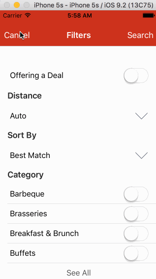

# Project 2 - *Yelp*

Yelp clone app using the [Yelp API](http://www.yelp.com/developers/documentation/v2/search_api) and referencing the [Yelp Style Guide](http://www.yelp.com/styleguide).

Time spent: an appropriate number of hours, reflecting both effort and efficiency

**Required** functionality:

- Search results page
  - [x] Table rows should be dynamic height according to the content height.
  - [x] Custom cells should have the proper Auto Layout constraints.
  - [x] Search bar should be in the navigation bar (doesn't have to expand to show location like the real Yelp app does).
- Filter page. Unfortunately, not all the filters are supported in the Yelp API.
  - [ ] The filters you should actually have are: category, sort (best match, distance, highest rated), distance, deals (on/off).
  - [ ] The filters table should be organized into sections as in the mock.
  - [ ] You can use the default UISwitch for on/off states.
  - [ ] Clicking on the "Search" button should dismiss the filters page and trigger the search w/ the new filter settings.
  - [ ] Display some of the available Yelp categories (choose any 3-4 that you want).

**Optional** features:

- Search results page
  - [ ] Infinite scroll for restaurant results.
  - [ ] Implement map view of restaurant results.
- Filter page
  - [ ] Implement a custom switch instead of the default UISwitch.
  - [ ] Distance filter should expand as in the real Yelp app
  - [ ] Categories should show a subset of the full list with a "See All" row to expand. Category list is [here](http://www.yelp.com/developers/documentation/category_list).
  - [ ] Implement the restaurant detail page.

**Additional** features:

- [ ] List anything else that you can get done to improve the app functionality!

Discussion topics (examples include better ways to implement something, how to extend your app in certain ways, etc):

1. topic 1
2. topic 2

## Video Walkthrough

GIF created with [LiceCap](http://www.cockos.com/licecap/).

